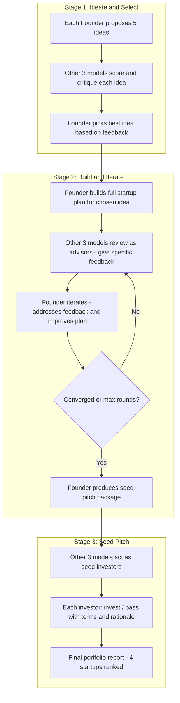

# VC AI Incubator -- Improvement Specification v2

## Vision

Four AI models each act as startup founders. They propose ideas, receive cross-feedback, pick their best idea, build it out iteratively with the other models as advisors, and produce a seed-investment-ready package. Maximum 3 stages.

## Architecture

## Model Sustainability Assessment

| Model | API Style | Context | JSON Reliability | Cost per Run | Notes |
|-------|-----------|---------|-----------------|-------------|-------|
| GPT-5.2 | Responses API | 128k+ | Excellent - native structured output | ~$3-5 | Strong at business reasoning and iteration |
| Claude Opus 4.5 | Messages API | 200k | Good - follows instructions well | ~$4-6 | Best at long-form document generation |
| DeepSeek Reasoner | OpenAI-compat Chat | 64k | Fair - may emit CoT before JSON | ~$0.30 | Needs robust JSON extraction; great value |
| Gemini 3 Pro | OpenAI-compat Chat | 1M+ | Good - native JSON mode available | ~$1-2 | Huge context fits all feedback history |

**Total estimated cost per full pipeline run: $8-14**

**Key risk:** DeepSeek Reasoner sometimes wraps JSON in markdown fences or prefixes chain-of-thought text. The JSON parser must handle this -- strip fences, find first/last curly brace.

**Token budget per stage:**
- Stage 1: ~80 API calls (20 idea generations + 60 cross-scores) at ~800 tokens avg output = ~64k output tokens
- Stage 2: ~48 calls (4 founders x 3 rounds x 4 calls) at ~1500 tokens avg = ~72k output tokens  
- Stage 3: ~16 calls (4 pitches + 12 investor evaluations) at ~2000 tokens avg = ~32k output tokens
- **Total: ~144 calls, ~168k output tokens**

All models can handle this within their context windows and rate limits.

---

## Stage 1: Ideate and Select

### What happens
1. Each of the 4 models generates 5 startup idea cards
2. Each idea is cross-evaluated by the other 3 models (feedback, not just a number)
3. Each founder model receives all feedback on its 5 ideas and picks the single best one to pursue

### Prompts needed

#### `ideas_prompt.txt` -- Founder generates ideas
- Persona: "You are a startup founder with deep technical expertise and market intuition"
- Generate 5 diverse ideas across different verticals
- Each idea must include: title, summary, target customer, why now, market size estimate, unfair advantage
- Quality bar: ideas should be specific enough to build, not generic
- Anti-patterns to avoid: vague AI wrappers, me-too SaaS, ideas without clear customer

#### `feedback_prompt.txt` -- Advisor critiques ideas (replaces old score_prompt)
- Persona: "You are an experienced startup advisor reviewing a fellow founder's ideas"
- For each idea: score 1-10, top strength, top weakness, one specific suggestion to improve it
- Also rank which of the 5 ideas has the most potential and why
- Be constructive but honest -- the founder needs real feedback to pick well

#### `select_prompt.txt` -- Founder picks best idea (NEW)
- Given: your 5 ideas + all feedback from 3 advisors
- Pick the single best idea to pursue
- Explain: why this one, what feedback you're incorporating, what you'd change based on advice
- Output: the selected idea with any refinements applied

### Schema changes
- `IDEA_CARD_SCHEMA`: add `why_now`, `target_customer`, `unfair_advantage`, `market_size_estimate`
- `FEEDBACK_SCHEMA` (new): `idea_id`, `reviewer_provider`, `score`, `top_strength`, `top_weakness`, `suggestion`, `rank` (which idea is best)
- `SELECTION_SCHEMA` (new): `selected_idea_id`, `founder_provider`, `reasoning`, `refined_idea` (updated idea card incorporating feedback)

---

## Stage 2: Build and Iterate

### What happens
1. Each founder builds a comprehensive startup plan for their selected idea
2. The other 3 models review the plan as domain-specific advisors
3. The founder iterates based on feedback (up to 3 rounds, or until advisors signal "ready")
4. Convergence check: if all 3 advisors score >= 7 and have no critical issues, the startup graduates

### Prompts needed

#### `build_prompt.txt` -- Founder creates full startup plan (replaces old one_pager_prompt)
- Given: selected idea + all previous feedback
- Produce a comprehensive startup plan covering:
  - Problem: quantified pain, who suffers, current alternatives
  - Solution: product description, key features, differentiation
  - Market: TAM/SAM/SOM with reasoning
  - Business Model: revenue streams, pricing, unit economics sketch
  - Go-to-Market: first 100 customers strategy, growth channels
  - Competitive Landscape: 3-5 competitors, why you win
  - Risks and Mitigations: top 3 risks with concrete mitigations
  - 12-Month Roadmap: key milestones, what you'd build with seed money
  - Funding Ask: how much seed capital, what it buys, target metrics

#### `advisor_review_prompt.txt` -- Advisor reviews startup plan (NEW)
- Persona: rotates between 3 advisor types per round:
  - Round 1: "Market strategist" -- focuses on market sizing, GTM, competitive positioning
  - Round 2: "Technical advisor" -- focuses on feasibility, product roadmap, engineering risks
  - Round 3: "Financial advisor" -- focuses on unit economics, funding strategy, milestones
- Give: overall readiness score 1-10, 3 specific issues to fix, 1 thing that's working well
- Signal: "ready_for_pitch" boolean -- true if this startup could credibly pitch to seed investors

#### `iterate_prompt.txt` -- Founder incorporates feedback (NEW)
- Given: current plan + latest advisor feedback from all 3 advisors
- Address each piece of critical feedback specifically
- Produce updated plan with changes highlighted
- If all advisors said "ready_for_pitch", acknowledge and prepare for Stage 3

### Schema changes
- `STARTUP_PLAN_SCHEMA` (new): structured object with all plan sections
- `ADVISOR_REVIEW_SCHEMA` (new): `reviewer_provider`, `advisor_role`, `readiness_score`, `issues` array, `strength`, `ready_for_pitch`
- `ITERATION_SCHEMA` (new): `founder_provider`, `round_number`, `changes_made` array, `updated_plan`

### Convergence logic
- Max 3 iteration rounds
- Early exit if all 3 advisors set `ready_for_pitch: true`
- If not converged after 3 rounds, proceed to Stage 3 anyway (some startups pitch before they're perfect)

---

## Stage 3: Seed Pitch

### What happens
1. Each founder produces a complete seed pitch package
2. The other 3 models act as seed-stage investors evaluating the pitch
3. Each investor decides: invest or pass, with terms and rationale
4. Final output: portfolio report ranking all 4 startups by investability

### Prompts needed

#### `pitch_prompt.txt` -- Founder creates seed pitch (NEW)
- Given: final startup plan after iterations
- Produce a seed pitch package:
  - Elevator Pitch: 2-3 sentences
  - Problem/Solution fit narrative
  - Traction/validation evidence (even if hypothetical at this stage, describe how you'd validate)
  - Team requirements: what founding team you'd need
  - The Ask: seed round size, use of funds, key milestones the money buys
  - Why Now: market timing argument
  - Vision: where this goes in 5 years

#### `investor_eval_prompt.txt` -- Investor evaluates pitch (NEW)
- Persona: "You are a seed-stage VC partner evaluating this pitch for your fund"
- Decision: INVEST or PASS
- If INVEST: proposed terms (check size, valuation range, key conditions)
- If PASS: specific reasons and what would change your mind
- Score dimensions: team fit (20%), market (25%), product (20%), traction potential (15%), terms (20%)
- Overall conviction score 1-10

#### Portfolio report (code-generated, not LLM)
- Aggregate all investor decisions
- Rank startups by: number of investors who'd invest, average conviction score
- Show each startup's journey: original idea -> selection reasoning -> iteration history -> final pitch -> investor verdicts

### Schema changes
- `PITCH_SCHEMA` (new): structured seed pitch package
- `INVESTOR_DECISION_SCHEMA` (new): `investor_provider`, `decision` enum invest/pass, `terms` object (if invest), `pass_reasons` (if pass), `dimension_scores`, `conviction_score`, `would_change_mind`
- `PORTFOLIO_REPORT_SCHEMA` (new): aggregated results

---

## Code Quality Improvements (applies across all stages)

### Fix JSON extraction for DeepSeek
- Strip markdown code fences from responses
- Find JSON object between first `{` and last `}` in response text
- Handle chain-of-thought prefix before JSON payload

### Consolidate retry logic
- Providers: retry HTTP errors only (429, 5xx, timeouts)
- Pipeline: retry JSON parse/schema failures only
- Single `RetryConfig` dataclass shared across both layers

### Add structured logging
- Replace `print()` with Python `logging`
- Log: stage, provider, round, latency, token counts where available
- `--verbose` flag for debug-level output

### Provider interface enforcement
- `MockProvider` must inherit `BaseProvider` or implement a `Provider` Protocol
- All providers must implement `generate(prompt, max_tokens) -> str`

### Dynamic provider count
- Remove hardcoded `EXPECTED_IDEAS = 20` etc.
- Calculate from `len(providers) * ideas_per_provider`

### Add tests
- `tests/test_pipeline_mock.py` -- full 3-stage run with mock providers
- `tests/test_schemas.py` -- all schemas validate correctly
- `tests/test_json_extraction.py` -- handles fences, CoT prefix, malformed responses

### Config file
- `pipeline.yaml` for provider selection, iteration limits, scoring thresholds

---

## Implementation Order

1. Fix code quality: JSON extraction, retry logic, logging, provider interface, dynamic counts
2. Rewrite prompts and schemas for Stage 1 (Ideate and Select)
3. Implement Stage 1 pipeline logic (ideas -> feedback -> selection)
4. Add prompts and schemas for Stage 2 (Build and Iterate) with convergence loop
5. Add prompts and schemas for Stage 3 (Seed Pitch) with investor decisions
6. Add portfolio report generator
7. Update MockProvider to support all new stages
8. Add tests
9. Update README with full documentation

---

## File Summary

### Modified
| File | Changes |
|------|---------|
| `vc_agents/schemas.py` | Enriched idea card, new schemas for all stages |
| `vc_agents/pipeline/run.py` | 3-stage pipeline with iteration loop, dynamic counts |
| `vc_agents/providers/base.py` | JSON extraction helper, RetryConfig, ABC |
| `vc_agents/providers/mock.py` | Support all new stages, inherit BaseProvider |
| `vc_agents/pipeline/prompts/ideas_prompt.txt` | Full rewrite with founder persona |
| `requirements.txt` | Add pytest, pyyaml |
| `README.md` | Full docs update |
| `.env.example` | New config options |

### New
| File | Purpose |
|------|---------|
| `vc_agents/pipeline/prompts/feedback_prompt.txt` | Advisor critiques ideas |
| `vc_agents/pipeline/prompts/select_prompt.txt` | Founder picks best idea |
| `vc_agents/pipeline/prompts/build_prompt.txt` | Full startup plan |
| `vc_agents/pipeline/prompts/advisor_review_prompt.txt` | Advisor reviews plan |
| `vc_agents/pipeline/prompts/iterate_prompt.txt` | Founder iterates on feedback |
| `vc_agents/pipeline/prompts/pitch_prompt.txt` | Seed pitch package |
| `vc_agents/pipeline/prompts/investor_eval_prompt.txt` | Investor evaluation |
| `vc_agents/pipeline/report.py` | Portfolio report generator |
| `vc_agents/logging_config.py` | Structured logging |
| `pipeline.yaml` | Pipeline configuration |
| `tests/test_pipeline_mock.py` | Full mock pipeline test |
| `tests/test_schemas.py` | Schema validation tests |
| `tests/test_json_extraction.py` | JSON extraction edge cases |
| `tests/conftest.py` | Shared fixtures |

### Removed
| File | Reason |
|------|--------|
| `vc_agents/pipeline/prompts/one_pager_prompt.txt` | Replaced by build_prompt.txt |
| `vc_agents/pipeline/prompts/score_prompt.txt` | Replaced by feedback_prompt.txt |
