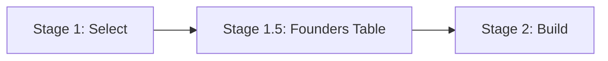
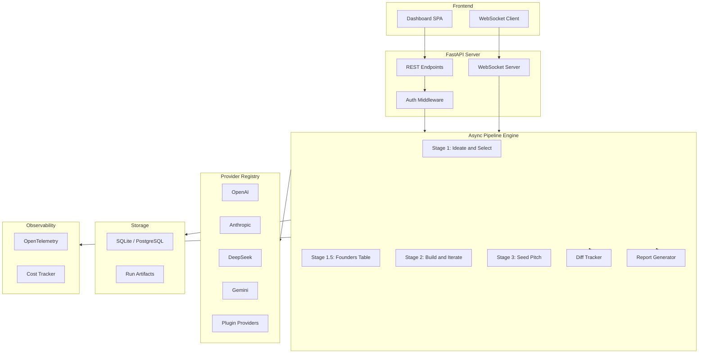

# VC AI Incubator v3.0 -- Improvement Plan

## Current State (v2.0)

The pipeline runs 3 stages with 4 LLM founders: Ideate/Select, Build/Iterate, Seed Pitch. It has a FastAPI dashboard with real-time WebSocket streaming, mock providers for testing, and structured JSON schemas for all stages. All output is JSONL files + a CSV portfolio report.

---

## Area 1: Smarter Pipeline -- Better VC Dynamics

### 1.1 Founder Personality Profiles

Right now all 4 founders get the same persona prompt. Each founder should have a distinct personality that influences their ideas and decision-making:

- **The Technical Visionary** -- prioritizes deep tech, defensible IP, long R&D cycles
- **The Growth Hacker** -- prioritizes distribution, virality, rapid iteration
- **The Domain Expert** -- prioritizes industry knowledge, regulatory moats, enterprise sales
- **The Contrarian** -- prioritizes overlooked markets, counterintuitive bets, first-mover plays

Store these in `pipeline.yaml` as configurable persona blocks. Each persona injects a system-level instruction into every prompt for that founder.

### 1.2 Cross-Founder Debate Round (New Stage 1.5)

After idea selection but before building, add a **Founders Table** round:

- All 4 founders present their selected idea in a shared context
- Each founder challenges the others with one hard question
- Founders must defend or pivot based on the challenges
- This creates natural differentiation and tests conviction early

### 1.3 Dynamic Advisor Matching

Instead of round-robin advisor roles, match advisors to the startup's needs:

- Analyze the startup plan to identify its weakest section
- Assign the most relevant advisor role to focus on that weakness
- Track which advice was actually incorporated (diff between plan versions)
- Score founders on their receptiveness to feedback

### 1.4 Investor Syndicate Dynamics

Make Stage 3 more realistic:

- **Lead investor** -- first investor to commit sets terms, others follow or pass
- **Due diligence questions** -- investors can ask 2-3 clarifying questions before deciding
- **Term negotiation** -- if 2+ investors want in, simulate a lightweight term sheet negotiation
- **Portfolio construction** -- investors have a fund thesis that influences which startups they favor

### 1.5 Multi-Cohort Mode

Run multiple cohorts and compare results:

- Same sector, different model combinations
- Same models, different sectors
- Track which model "wins" most often across cohorts
- Statistical analysis of model strengths (which model is best as founder vs advisor vs investor)

---

## Area 2: Richer Output and Analysis

### 2.1 Structured HTML Report Generator

Replace the CSV portfolio report with a rich HTML report:

- Executive summary with key metrics
- Per-startup deep dive: idea journey from initial proposal through iterations to final pitch
- Side-by-side comparison of all 4 startups
- Advisor feedback timeline showing how the plan evolved
- Investor decision breakdown with dimension scores visualized as radar charts
- Export to PDF option

### 2.2 Diff Tracking Between Iterations

Track exactly what changed between plan versions:

- Store semantic diffs (which sections changed, what was added/removed)
- Measure "iteration velocity" -- how much does each founder improve per round
- Highlight which advisor feedback was addressed vs ignored
- This data feeds into the final report and also the advisor scoring

### 2.3 Market Research Integration

Add an optional stage that enriches ideas with real data:

- Web search for market size validation (using a search API or tool-use capable model)
- Competitor lookup to ground the competitive landscape in reality
- News/trend analysis to validate the "why now" narrative
- Flag ideas that overlap with existing well-funded startups

### 2.4 Scoring Dashboard

Add aggregate analytics to the web dashboard:

- Model leaderboard across runs (who generates the best ideas, who gives the best feedback)
- Sector heat map (which sectors produce the most investable startups)
- Correlation analysis (does higher feedback score predict investor interest)
- Cost tracking per run (actual token usage and spend)

---

## Area 3: Web Dashboard Improvements

### 3.1 Persistent Storage

Replace in-memory `_runs` dict with a real data layer:

- SQLite database for run metadata, events, and results
- Store all JSONL data in the DB instead of files
- Enable run history that survives server restarts
- Add run comparison: select 2+ runs and compare side-by-side

### 3.2 Real-Time Dashboard Enhancements

- **Live idea cards** -- show ideas as they're generated, not just after the stage completes
- **Advisor feedback stream** -- show each advisor's review as it comes in during Stage 2
- **Convergence graph** -- plot readiness scores across iteration rounds per founder
- **Cost meter** -- estimated cost accumulator that updates in real-time

### 3.3 Configuration Management

- Save/load run configurations as named presets
- Template configurations for common scenarios (quick demo, full run, sector deep-dive)
- Override individual provider settings per run
- Support custom prompt overrides from the UI

### 3.4 Authentication and Multi-User

- Basic auth for the dashboard (protect API keys)
- Per-user run history
- Shared view links for completed runs (read-only, no keys exposed)
- Rate limiting to prevent runaway API costs

### 3.5 Deployment Readiness

- Dockerfile for containerized deployment
- Docker Compose with optional PostgreSQL for persistence
- Environment-based configuration (12-factor app style)
- Health check endpoint
- Vercel/Railway/Render deployment guide

---

## Area 4: Code Quality and Developer Experience

### 4.1 Async Pipeline

Convert the pipeline from sync to async:

- Use `asyncio` for concurrent API calls instead of `ThreadPoolExecutor`
- Eliminates the awkward `run_coroutine_threadsafe` bridge in the web server
- Better cancellation support (stop a running pipeline from the UI)
- Streaming token output for supported providers

### 4.2 Provider Plugin System

Make it easy to add new providers:

- Provider registry with auto-discovery
- Each provider is a self-contained module with its own config schema
- Support tool-use/function-calling for providers that offer it
- Add providers: Mistral, Llama (via Groq/Together), Cohere

### 4.3 Prompt Versioning

- Store prompts with version numbers
- A/B test different prompt versions across runs
- Track which prompt version produced better outcomes
- Allow prompt editing from the web UI with diff preview

### 4.4 Observability

- OpenTelemetry tracing for the full pipeline
- Per-call latency, token count, and cost metrics
- Error rate tracking by provider and stage
- Alerting on cost thresholds

### 4.5 End-to-End Integration Tests

- Test with real API calls (gated behind env vars, not run in CI by default)
- Snapshot testing for prompt formatting
- Load testing for concurrent pipeline runs
- Contract tests for provider API compatibility

---

## Suggested Implementation Order

1. **Persistent storage** -- SQLite backend, biggest UX win, unblocks run comparison
2. **Founder personality profiles** -- small change, big quality improvement in output diversity
3. **Diff tracking between iterations** -- makes Stage 2 output dramatically more useful
4. **HTML report generator** -- replaces CSV with something shareable
5. **Founders Table debate round** -- new stage that makes the simulation more compelling
6. **Async pipeline** -- architectural improvement that unblocks streaming and cancellation
7. **Live dashboard enhancements** -- real-time cards, convergence graphs
8. **Investor syndicate dynamics** -- deepens Stage 3 realism
9. **Scoring dashboard** -- analytics layer on top of accumulated run data
10. **Deployment readiness** -- Dockerfile, compose, deploy guides
11. **Provider plugin system** -- extensibility for new models
12. **Market research integration** -- optional enrichment with real data
13. **Multi-cohort mode** -- meta-analysis across runs
14. **Auth and multi-user** -- needed for any shared deployment
15. **Observability** -- OpenTelemetry, cost tracking

---

## Architecture Overview (v3.0)

